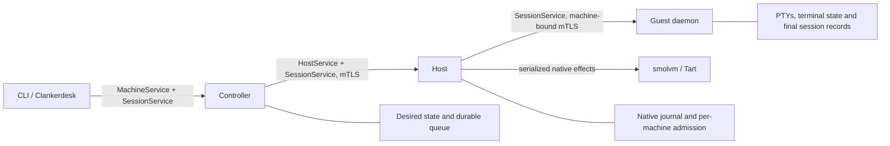

# Module contracts

Clankerbox separates public admission, native execution, and terminal ownership.
Each service owns its resources through shutdown; callers use the generated RPC
contract rather than accessing another service's journal.

The three SessionService mounts share a schema, with authorization enforced by
each endpoint. The controller authenticates public consumers and routes machines;
the host authenticates its controller and admits the owned machine; the guest
checks its host, binding epoch and machine identity. Private credentials and native
installation paths do not cross the public resource boundary.

## Client and controller

`client.Run` takes output streams and a cancellation context. Each invocation
builds a fresh urfave/cli command tree; help bypasses configuration and service
startup. The client owns authenticated requests, resource formatting and operation
waits. It rereads the token file per request, disables ambient proxies and redirects,
and does not resubmit an uncertain mutation. After a successful wait, it reads the
resource summary using the parent context; a failed summary read preserves the
known successful operation outcome.

The controller owns desired state, durable acceptance, idempotency and capacity
reservations. One reconciliation worker per host dispatches mutations and records
their outcomes. An explicit creation host goes directly to admission; discovery is
needed only when the caller omitted it. Previously accepted requests remain
resolvable even when current host or profile eligibility changes.

Domain errors carry a finite reason and retryable flag. The RPC boundary translates
them into Connect errors; a missing row is distinct from a database failure or
cancellation. Human-readable messages are not an error classification mechanism.

## Host, profiles and checkpoints

The host owns native execution and its operation journal. Serialized mutation
ownership is separate from the short guest-admission lock. Durable unfinished work
reserves all affected sources and destinations; unrelated machines can keep using
sessions. Binding preparation occurs outside admission, then rechecks the machine
epoch and reservations before publishing a lease. Accepted work is presented as
pending/running while its owner is active; interrupted unresolved work remains
fenced for explicit reconciliation.

Profiles contain portable compatibility fields and image digests. Host configuration
resolves local image paths, and capabilities are computed for public discovery.
Runtime and image pins identify content, so moving an identical verified bundle
does not change compatibility. Native supervisor files are derived from the current
owned configuration and are refreshed for retained starts.

Checkpoint identity retains its capture profile and runtime pin. Fork and restore
check compatibility and backing dependencies. Deleting an owned checkpoint does
not require its capture profile to remain active or unchanged. RAM deletion owns
its artifact directory; Tart deletion uses the owning native runtime and its
stopped-copy checks. Both retain operation journaling, identity checks and explicit
outcome handling.

## Guest sessions and transport lifetime

The guest daemon owns its singleton, authenticated listeners and binding identity.
`internal/guest/session` owns PTYs, terminal state, bounded history, control admission
and final records. The workload runs as an unprivileged guest user; the privileged
daemon keeps binding keys and administration inaccessible to that workload.
Rebinding a copied guest retains its session manager while replacing its identity.

An attachment has one control reader, one response writer and one bounded event
queue. Opened is first. Control acknowledgements may interleave with the immutable
bootstrap prefix; live terminal events follow that prefix. Clean request EOF drains
a finite queued response boundary and detaches. Cancellation interrupts and joins
stream I/O. Neither relays nor consumers replay uncertain terminal input. See
[terminal sessions](terminal-sessions.md) for the complete streaming contract.

Controller-to-host clients live with the controller. Guest transports live with
verified machine bindings. The host owns credential renewal and fences replacement
until installation is verified; caller cancellation cannot abandon renewal midway
and expose an unverified binding. Common transport mechanics live in
`internal/rpctransport`, while each endpoint retains its authorization policy.

Shutdown first closes admission and cancels owned work, then joins handlers,
stream workers and persistence before releasing databases, terminal state or locks.
Guest shutdown terminates sessions concurrently and persists their final records.
A shutdown deadline reports failure; it does not authorize freeing resources still
used by background work. Controller and host restarts retain native VMs and PTYs.

## Local development

`clankerbox dev` starts the ordinary controller and persistent host service in a
project-owned environment. Its manifest binds one immutable bundle identity and
separate private host namespace. The CLI and Desk consume published configuration
files. Stop/start retains that environment; moving identical bundle content repairs
owned locators. Changing bundle content requires destroy/recreate. Teardown is
resumable and acts only on resources recorded by that environment. See
[local development](local-development.md).

## Private storage

`statefs.Open(path)` owns creation and validation of a current-user-owned `0700`
directory, returns a held directory handle, and rejects unsafe existing roots.
It does not silently change existing directory permissions. Ancestors must be
owned by the current user or root and protected against writes by other users;
sticky temporary directories are allowed. Parent symlinks are canonicalized,
but the selected private state directory itself may not be a symlink.
File operations accept trusted containing-directory aliases while rejecting
symlinks in the final file component.

Directory operations accept single-component names. Private reads validate the
opened file's ownership, type, and permissions, then read the same descriptor.
Private append opens validate the write descriptor and preserve existing contents
without reading them, so opening a retained guest log does not load its history.
Descriptor-relative opening rejects final symlinks and cannot block on a FIFO.
Ordinary user configuration may be readable by others, but may not be writable
by them. Atomic replacement syncs both contents and the containing directory;
an error after rename can mean the replacement is already visible.

`Dir.Lock` owns advisory lock acquisition and release. `Dir.Database` prepares
the fixed database file and validates existing WAL, SHM, and rollback-journal
companions. Keep the application lock and directory open until SQLite closes.
SQLite reopens paths itself, so the directory must not be moved or replaced
while the database is in use. A process running as the same user, or root, is
trusted; these checks are not a sandbox against that identity.

The controller uses `controller.db` and `controller.lock`. The host retains
`host.db`, its ownership marker, and its short initialization lock. The client has no durable pin or reservation state.

## Release boundary

The 0.3.0 format and RPC change requires empty application state and matching
controller, host, guest and Desk releases. Deployment configuration and authorized
reset procedures belong to personal-cloud. Ordinary subsequent service restarts
retain journals, native machines and session identity; they are not resets.
