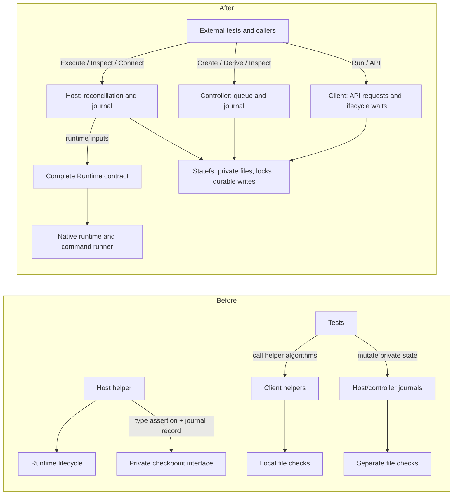

# Module contracts and state cutover

Prefer external Go test packages for supported behavior; use internal policy tests
where a public test would require long sleeps or oversized workloads. Production
types do not expose journal accessors, private helper aliases, or test-only hooks.
The HTTP, SSH, Unix socket, runtime command, and process boundaries remain real:
they have distinct lifetimes and failure behavior.

## Ownership change

Before this refactor, private test access bypassed the behavior under test, and
security policy was duplicated among client, controller, and host file helpers.
The runtime lifecycle interface also omitted checkpoint support, which required
a private optional interface and a journal-shaped argument.

## Public behavior

The client owns authenticated API requests, resource output and lifecycle waits.
It has no forwarding owner, IPC leases, local listeners or SSH identity state.
The controller owns the restricted SSH link to the guest session daemon.

## Client command boundary

`client.Run` takes output streams and a cancellation context. Each invocation builds
a fresh urfave/cli command tree. The client, controller, and host binaries
use native flag parsing and generated help; help bypasses configuration and
service startup. Machine names are positional, with no `--name` alias. Resource
output is human-readable by default; global `--json` selects structured stdout.
Executable errors are plain text on stderr.
CLI lifecycle and session-list commands use authenticated HTTP; events use SSE.
Both use the same verified transport, with ambient proxies and redirects disabled.
SSE removes only the ordinary request timeout; cancellation still ends the stream.
An explicit creation host is sent directly to the controller. Only an omitted host
requires discovery, so a discovery change cannot prevent an idempotent retry from
returning its already accepted operation.
The raw guest SSH endpoint and workstation connection commands do not exist.
Tests exercise retained command behavior through HTTP and process boundaries.

## Host and checkpoint boundary

Guest preparation and restricted connections share one readiness check: an owned,
prepared machine, a succeeded current generation, and a running runtime with a
valid endpoint. Preparation keeps its mutation lock; connections do not hold that
lock for the lifetime of a stream. Runtime guest scripts travel on stdin on both
platforms, including scripts that carry a child's private host key.

Checkpoint identity retains its captured profile and runtime pin. Restore requires
the same physical profile and current runtime configuration; discovery-only
capability changes do not rewrite or invalidate the captured identity. Pins are
checked against the archived profile, not rehashed with current discovery metadata.

RAM checkpoint deletion needs the configured owning host and its owned artifact
directory, not a still-installed capture runtime or active profile. It retains
exact checkpoint identity, dependency/reservation checks, the operation journal
and the deleted record. Ambiguous deletion is never replayed automatically.
Tart checkpoint deletion still needs compatible runtime placement and native
stopped-clone checks because it invokes Tart rather than removing an artifact
directory. No checkpoint migration or alternate legacy validation path is added.

## Guest session boundary

`clankerbox-guest` runs inside a machine as the SSH user and is a new process
boundary with its own lifetime: it outlives every consumer connection, the
controller's SSH link, and the controller itself, and it ends only with the
machine or an explicit daemon stop. `internal/guest/session` owns PTY, VT,
ring, attach, input admission, and teardown policy; `internal/guest/daemon`
owns the singleton lock, the private socket with peer-credential checks, and
per-connection protocol handling; `internal/guest/protocol` is the wire
contract shared with consumers, pinned by the conformance and messages
fixtures under `protocol/`. The controller's `guestLink` registry owns link
eligibility, suspension around copies, stream capacity, and materialized
`guest` status; it bridges upgraded streams without parsing them and runs a
protocol client only for listing and the readiness probe. Same-user processes
in the guest are trusted; the terminal key restricts transport, not authority.

## Private storage

Local development uses the same controller and guest process boundaries through
`clankerbox dev`. Its private local transport retains the one machine's operation
journal and SSH identity, authenticates the controller's terminal key, and exposes
only the guest proxy command. The detached guest outlives controller cancellation;
explicit dev stop owns guest shutdown through a separate private Unix socket.
Local sessions can select a default workspace without changing production guests'
home-directory default or the guest wire protocol. See
[local development](local-development.md).

`statefs.Open(path)` owns creation and validation of a current-user-owned `0700`
directory, returns a held directory handle, and rejects unsafe existing roots.
It does not silently change existing directory permissions. Ancestors must be
owned by the current user or root and protected against writes by other users;
sticky temporary directories are allowed. Parent symlinks are canonicalized,
but the selected private state directory itself may not be a symlink.
File operations accept trusted containing-directory aliases while rejecting
symlinks in the final file component.

Directory operations accept single-component names. Private reads validate the
opened file's ownership, type, and permissions, then read the same descriptor.
Private append opens validate the write descriptor and preserve existing contents
without reading them, so opening a retained guest log does not load its history.
Descriptor-relative opening rejects final symlinks and cannot block on a FIFO.
Ordinary user configuration may be readable by others, but may not be writable
by them. Atomic replacement syncs both contents and the containing directory;
an error after rename can mean the replacement is already visible.

`Dir.Lock` owns advisory lock acquisition and release. `Dir.Database` prepares
the fixed database file and validates existing WAL, SHM, and rollback-journal
companions. Keep the application lock and directory open until SQLite closes.
SQLite reopens paths itself, so the directory must not be moved or replaced
while the database is in use. A process running as the same user, or root, is
trusted; these checks are not a sandbox against that identity.

The controller uses `controller.db` and `controller.lock`. The host retains
`host.db`, its ownership marker, and its short initialization lock. The client has no durable pin or reservation state.

## Retained-state cutover

The controller command now requires `--state-dir`; `--db` has been removed.
There is no dual-layout fallback. The repository records deployed infrastructure
and retained journals, so this source refactor does not assume those can be reset.

For an existing controller, stop the old service, retain a consistent SQLite
backup, and place the retained database at `controller.db` inside the new private
state directory. Preserve all committed WAL data when taking that backup; copying
only the main file from a live database is not sufficient. Update the service to
use `--state-dir`, and validate reopening and pending operations before removing
the retained original. Database files and existing SQLite companions must be
private regular files owned by the service user. Verify the containing directory
and ancestors meet the contract above.

No retained local journal or live deployment is moved by this code change.
Historical spike commands using their own `--db` option are separate programs
and retain their existing interfaces.
