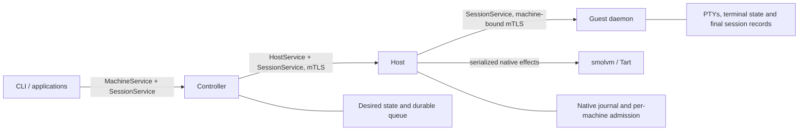

# Module contracts

Clankerbox is three services with exclusive ownership of their state. Callers
cross a service boundary only through the generated RPC contract.

The three SessionService mounts share one schema; each endpoint enforces its own
authorization. The controller authenticates public callers and routes to the
machine's host; the host authenticates its controller and admits the machine;
the guest checks its host, binding epoch and machine identity. Credentials and
native installation paths never appear in public resources.

## Client and controller

`client.Run` takes output streams and a context and builds a fresh urfave/cli
command tree per invocation; help never touches configuration or services. The
client rereads the token file per request, disables ambient proxies and
redirects, and never resubmits an uncertain mutation. After a successful wait it
reads the resource summary; a failed summary read still reports the operation's
outcome.

The controller owns desired state, durable acceptance, idempotency and capacity
reservations, with one wake-driven reconciliation worker per host. Committed
submissions wake idle workers; startup scans and persisted retry deadlines keep
the durable queue authoritative. An explicit host goes
straight to admission; discovery runs only when the caller omitted it. Accepted
requests stay resolvable even if host or profile eligibility later changes.

Domain errors carry a finite reason and a retryable flag, translated to Connect
errors at the RPC boundary. A missing row is distinct from a database failure or
a cancellation. Messages are for humans, not for classification.

## Host, profiles and checkpoints

The host owns native execution and its operation journal. Mutations are
serialized per host; guest admission uses a separate short lock, so unrelated
machines keep their sessions while a fork or checkpoint runs. Unfinished work
reserves every affected source and destination. Binding preparation happens
outside admission and rechecks the machine epoch and reservations before a
lease is published. An interrupted capture discards its partial artifact and
fails, an interrupted checkpoint deletion replays because artifact removal is
idempotent, and an interrupted child stays fenced until explicitly reconciled.
The checkpoint catalog lists only published artifacts and their tombstones; a
capture in flight or one that failed is visible through its operation alone.

Profiles carry portable compatibility fields and image digests; the host
resolves local image paths from its own configuration and derives capabilities.
Prepared images own the guest executable, account and system permissions.
Native binding, retained startup and live rebinding have distinct intent; live
renewal never cold-starts a missing manager. See [ADR 0007](adr/0007-prepared-guest-images.md).
Runtime and image pins identify content, so relocating an identical bundle does
not change compatibility. Supervisor files are rendered from the current
configuration and refreshed on retained starts.

A checkpoint keeps its capture profile and runtime pin. Fork and restore check
compatibility and backing dependencies. Deleting a checkpoint does not require
its capture profile to still exist. RAM checkpoints own an artifact directory;
Tart checkpoints are stopped-disk copies managed by the runtime.

## Guest sessions and transport lifetime

The guest daemon owns its singleton lock, listeners and binding identity.
`internal/guest/session` owns PTYs, terminal state, bounded history, control
admission and final records. Sessions run as root on both guest operating
systems; see the [guest trust model](terminal-sessions.md).
Rebinding a copied guest replaces its routing identity while keeping the session
manager. Machine storage uses private copies rather than shared writable backing.

An attachment has one control reader, one response writer and one bounded event
queue. `Opened` comes first, acknowledgements may interleave with the bootstrap
prefix, and live events follow the prefix. A clean request EOF drains the
already-queued responses and detaches; cancellation interrupts and joins stream
I/O. Nothing replays uncertain terminal input. See
[terminal sessions](terminal-sessions.md) for the full streaming contract.

Controller-to-host clients live with the controller; guest transports live with
verified machine bindings. The host owns credential renewal and fences
replacement until the new binding is installed and verified, regardless of
caller cancellation. Shared transport mechanics live in `internal/rpctransport`;
authorization stays with each endpoint.

Shutdown closes admission and cancels owned work, then joins handlers, stream
workers and persistence before releasing databases, terminal state or locks. A
shutdown deadline reports failure; it does not free resources still in use.
Controller and host restarts keep VMs and PTYs alive.

## Local development

`clankerbox dev` runs the controller and host service in a project-owned
environment bound to one bundle digest. See
[local development](local-development.md).

## Private state

`internal/statefs` owns private on-disk state: directory trust checks, symlink
rejection, advisory locks, SQLite companion-file validation and atomic
replacement. Its package documentation describes the rules. The controller keeps
`controller.db` and `controller.lock`; the host keeps `host.db`, its ownership
marker and an initialization lock; the client has no durable state.

## Runtime profile ownership

The controller owns the mutable profile catalog, build admission and CPU/RAM reservations. The host owns deployed bases, uploaded staging, build execution/logs and prepared revision artifacts. Setup runs outside lifecycle serialization; preparation and finalization remain serialized. Create admission atomically pins the selected revision and its settings. Deleting a profile does not invalidate machines/checkpoints; referenced revisions cannot be deleted. See [ADR 0008](adr/0008-runtime-built-profiles.md).
